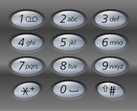
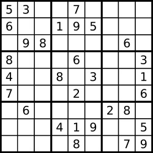

# 001-050
## 001 Two Sum
Given an array of integers nums and an integer target, return indices of the two numbers such that they add up to target.

Example

    Input: nums = [2,7,11,15], target = 9
    Output: [0,1]  
    Explanation: Because nums[0] + nums[1] == 9, we return [0, 1].

Two_Sum_Dict utilizes Dictionary<>
- containsKey(): hashes key into integer used for array's index. Expected O(1), worse case O(N) where N is the size of the hashtable.
- total O(N)

Two_Sum_Loops uses two loops:
- total O(n<sup>2</sup>) 
<br><br>


## 002 Add Two Numbers
You are given two non-empty single linked lists representing two non-negative integers. The digits are stored in reverse order, and each of their nodes contains a single digit. Add the two numbers and return the sum as a linked list.

You may assume the two numbers do not contain any leading zero, except the number 0 itself.

Example

    Input: l1 = [2,4,3], l2 = [5,6,4]
    Output: [7,0,8]
    Explanation: 342 + 465 = 807.

<br><br>

## 003 Longest Substring Without Repeating Characters
Given a string s, find the length of the longest substring without repeating characters.

Example 1
    
    Input: s = "abcabcbb"
    Output: 3
    Explanation: The answer is "abc", with the length of 3. 

Example 2

    Input: s = "pwwkew"
    Output: 3
    Explanation: The answer is "wke", with the length of 3.
    Notice that the answer must be a substring, "pwke" is a subsequence and not a substring.
<br><br>

## 004 Median of Two Sorted Arrays [Hard]
Given two sorted arrays nums1 and nums2 of size m and n respectively, return the median of the two sorted arrays.

The overall run time complexity should be O(log (m+n)).

Example 1
    
    Input: nums1 = [1,3], nums2 = [2]
    Output: 2.00000
    Explanation: merged array = [1,2,3] and median is 2.

Example 2

    Input: nums1 = [1,2], nums2 = [3,4]
    Output: 2.50000
    Explanation: merged array = [1,2,3,4] and median is (2 + 3) / 2 = 2.5.
<br><br>

## 005 Longest Palindromic SubstringLongest Palindromic Substring
Given a string s, return the longest palindromic substring in s.

Example 1
    
    Input: s = "babad"
    Output: "bab"
    Explanation: "aba" is also a valid answer.

Example 2

    Input: s = "cbbd"
    Output: "bb"

<b>Two Solutions</b>
1. Time O(N<sup>2</sup>): Search for Longest Palindrome at each index
2. Time O(N): Manacher’s Algorithm (https://www.youtube.com/watch?v=YVZttWzvyw8)

<br><br>

## 007 Reverse Integer
Given a signed 32-bit integer x, return x with its digits reversed. If reversing x causes the value to go outside the signed 32-bit integer range [-2<sup>31</sup>, 2<sup>31</sup> - 1], then return 0.

Assume the environment does not allow you to store 64-bit integers (signed or unsigned).

Example 1
    
    Input: x = 123
    Output: 321

Example 2

    Input: x = 120
    Output: 21
<br><br>


## 008 String to Integer (atoi)
Implement the ```myAtoi(string s)``` function, which converts a string to a 32-bit signed integer  (similar to C/C++'s atoi function).

The algorithm for myAtoi(string s) is as follows:
1. Read in and ignore any leading whitespace.
2. Check if the next character (if not already at the end of the string) is '-' or '+'. Read this character in if it is either. This determines if the final result is negative or positive respectively. Assume the result is positive if neither is present.
3. Read in next the characters until the next non-digit character or the end of the input is reached. The rest of the string is ignored.
4. Convert these digits into an integer (i.e. "123" -> 123, "0032" -> 32). If no digits were read, then the integer is 0. Change the sign as necessary (from step 2).
5. If the integer is out of the 32-bit signed integer range [-2<sup>31</sup>, 2<sup>31</sup> - 1], then clamp the integer so that it remains in the range. Specifically, integers less than -2<sup>31</sup> should be clamped to -2<sup>31</sup>, and integers greater than 2<sup>31</sup> - 1 should be clamped to 2<sup>31</sup> - 1.
6. Return the integer as result.

Note:
- Only the space character ' ' is considered a whitespace character.
- Do not ignore any characters other than the leading whitespace or the rest of the string after the digits.

Example 1
    
    Input: s = "42"
    Output: 42

    Explanation: 
    The underlined characters are what is read in, the caret is the current reader position.
    Step 1: "42" (no characters read because there is no leading whitespace)
             ^
    Step 2: "42" (no characters read because there is neither a '-' nor '+')
             ^
    Step 3: "42" ("42" is read in)
               ^
    The parsed integer is 42.
    Since 42 is in the range [-231, 231 - 1], the final result is 42.

Example 2

    Input: s = "   -42"
    Output: -42
    Explanation:
    Step 1: "   -42" (leading whitespace is read and ignored)
                ^
    Step 2: "   -42" ('-' is read, so the result should be negative)
                 ^
    Step 3: "   -42" ("42" is read in)
                   ^
    The parsed integer is -42.
    Since -42 is in the range [-231, 231 - 1], the final result is -42.
<br><br>

## 011 Container With Most Water
You are given an integer array height of length n. There are n vertical lines drawn such that the two endpoints of the ith line are ```(i, 0)``` and ```(i, height[i])```.

Find two lines that together with the x-axis form a container, such that the container contains the most water.

Return the maximum amount of water a container can store.

Notice that you may not slant the container.

Example 1

    Input: height = [1,8,6,2,5,4,8,3,7]
    Output: 49
    Explanation: The above vertical lines are represented by array [1,8,6,2,5,4,8,3,7]. In this case, the max area of water (blue section) the container can contain is 49.


Example 2
   
   Input: height = [1,1]
    Output: 1
<br><br>

## 013 Roman to Integer
Given a roman numeral, convert it to an integer.

        Symbol       Value
        I             1
        V             5
        X             10
        L             50
        C             100
        D             500
        M             1000

Special rules:
- I can be placed before V (5) and X (10) to make 4 and 9. 
- X can be placed before L (50) and C (100) to make 40 and 90. 
- C can be placed before D (500) and M (1000) to make 400 and 900.

Example 1

    Input: s = "LVIII"
    Output: 58
    Explanation: L = 50, V= 5, III = 3.

Example 2

    Input: s = "MCMXCIV"
    Output: 1994
    Explanation: M = 1000, CM = 900, XC = 90 and IV = 4.
<br><br>

## 014 Longest Common Prefix
Write a function to find the longest common prefix string amongst an array of strings.

If there is no common prefix, return an empty string ""

Example 1

    Input: strs = ["flower","flow","flight"]
    Output: "fl"

Example 2

    Input: strs = ["dog","racecar","car"]
    Output: ""
    Explanation: There is no common prefix among the input strings.
<br><br>

## 015 3Sum
Given an integer array nums, return all the triplets ```[nums[i], nums[j], nums[k]]``` such that ```i != j, i != k, and j != k```, and ```nums[i] + nums[j] + nums[k] == 0```.

Notice that the solution must not contain duplicate triplets.

Example 1

    Input: nums = [-1,0,1,2,-1,-4]
    Output: [[-1,-1,2],[-1,0,1]]

Example 2

    Input: nums = [0]
    Output: []
<br><br>

## 017 Letter Combinations of a Phone Number
Given a string containing digits from 2-9 inclusive, return all possible letter combinations that the number could represent. Return the answer in any order.

If there is no common prefix, return an empty string ""A mapping of digit to letters (just like on the telephone buttons) is given below. Note that 1 does not map to any letters.



Example 1

    Input: digits = "23"
    Output: ["ad","ae","af","bd","be","bf","cd","ce","cf"]

Example 2

    Input: digits = "2"
    Output: ["a","b","c"]
<br><br>


## 019 Remove Nth Node From End of List
Given the head of a linked list, remove the nth node from the end of the list and return its head.

Example 1


    Input: head = [1,2,3,4,5], n = 2
    Output: [1,2,3,5]

Example 2

    Input: head = [1], n = 1
    Output: []
<br><br>

## 020 Valid Parentheses
Given a string s containing just the characters '(', ')', '{', '}', '[' and ']', determine if the input string is valid.

An input string is valid if:

1. Open brackets must be closed by the same type of brackets.
1. Open brackets must be closed in the correct order.

Example 1

    Input: s = "()"
    Output: true

Example 2

    Input: s = "()[]{}"
    Output: true

Example 3

    Input: s = "(]"
    Output: false
<br><br>

## 021 Merge Two Sorted Lists
You are given the heads of two sorted linked lists list1 and list2.

Merge the two lists in a one sorted list. The list should be made by splicing together the nodes of the first two lists.

Return the head of the merged linked list.

Example 1


    Input: list1 = [1,2,4], list2 = [1,3,4]
    Output: [1,1,2,3,4,4]

Example 2

    Input: list1 = [], list2 = []
    Output: []
<br><br>

## 022 Generate Parentheses
Given n pairs of parentheses, write a function to generate all combinations of well-formed parentheses. 1<= n<= 8

Example 1

    Input: n = 3
    Output: ["((()))","(()())","(())()","()(())","()()()"]

Example 2

    Input: n = 1
    Output: ["()"]
<br><br>

## 026 Remove Duplicates from Sorted Array
Given an integer array nums sorted in <b>non-decreasing order</b>, remove the duplicates <b>in-place</b> such that each unique element appears only once. The relative should be kept the same.

Do not allocate extra space for another array. You must do this by modifying the input array in-place with O(1) extra memory.

Example 1

    Input: nums = [1,1,2]
    Output: 2, nums = [1,2,_]

Example 2

    Input: nums = [0,0,1,1,1,2,2,3,3,4]
    Output: 5, nums = [0,1,2,3,4,_,_,_,_,_]
<br><br>


## 029 Divide Two Integers
Given two integers dividend and divisor, divide two integers without using multiplication, division, and mod operator.

if the quotient is strictly greater than 2<sup>31</sup> - 1, then return 2<sup>31</sup> - 1, and if the quotient is strictly less than -2<sup>31</sup>, then return -2<sup>31</sup>.

Example 1

    Input: dividend = 10, divisor = 3
    Output: 3
    Explanation: 10/3 = 3.33333.. which is truncated to 3.

Example 2

    Input: dividend = 7, divisor = -3
    Output: -2
    Explanation: 7/-3 = -2.33333.. which is truncated to -2.
<br><br>


## 033 Search in Rotated Sorted Array
There is an integer array nums sorted in ascending order (with distinct values).

Prior to being passed to your function, nums is possibly rotated at an unknown pivot index k (1 <= k < nums.length) such that the resulting array is [nums[k], nums[k+1], ..., nums[n-1], nums[0], nums[1], ..., nums[k-1]] (0-indexed). 

For example, [0,1,2,4,5,6,7] might be rotated at pivot index 3 and become [4,5,6,7,0,1,2].

Given the array nums after the possible rotation and an integer target, return the index of target if it is in nums, or -1 if it is not in nums.

You must write an algorithm with O(log n) runtime complexity.

Example 1

    Input: nums = [4,5,6,7,0,1,2], target = 0
    Output: 4

Example 2

    Input: nums = [4,5,6,7,0,1,2], target = 3
    Output: -1
<br><br>

## 034 Find First and Last Position of Element in Sorted Array
Given an array of integers nums sorted in non-decreasing order, find the starting and ending position of a given target value.

If target is not found in the array, return [-1, -1].

You must write an algorithm with O(log n) runtime complexity.

Example 1

    Input: nums = [5,7,7,8,8,10], target = 8
    Output: [3,4]

Example 2

    Input: nums = [5,7,7,8,8,10], target = 6
    Output: [-1,-1]
<br><br>

## 036 Valid Sudoku
Determine if a 9 x 9 Sudoku board is valid. Only the filled cells need to be validated according to the following rules:

1. Each row must contain the digits 1-9 without repetition.
1. Each column must contain the digits 1-9 without repetition.
1. Each of the nine 3 x 3 sub-boxes of the grid must contain the digits 1-9 without repetition.


Note:

- A Sudoku board (partially filled) could be valid but is not necessarily solvable.
- Only the filled cells need to be validated according to the mentioned rules.

Example 1



    Input: board = 
    [["5","3",".",".","7",".",".",".","."]
    ,["6",".",".","1","9","5",".",".","."]
    ,[".","9","8",".",".",".",".","6","."]
    ,["8",".",".",".","6",".",".",".","3"]
    ,["4",".",".","8",".","3",".",".","1"]
    ,["7",".",".",".","2",".",".",".","6"]
    ,[".","6",".",".",".",".","2","8","."]
    ,[".",".",".","4","1","9",".",".","5"]
    ,[".",".",".",".","8",".",".","7","9"]]

    Output: true

Example 2

    Input: board = 
    [["8","3",".",".","7",".",".",".","."]
    ,["6",".",".","1","9","5",".",".","."]
    ,[".","9","8",".",".",".",".","6","."]
    ,["8",".",".",".","6",".",".",".","3"]
    ,["4",".",".","8",".","3",".",".","1"]
    ,["7",".",".",".","2",".",".",".","6"]
    ,[".","6",".",".",".",".","2","8","."]
    ,[".",".",".","4","1","9",".",".","5"]
    ,[".",".",".",".","8",".",".","7","9"]]

    Output: false
<br><br>

## 038 Count and Say
The count-and-say sequence is a sequence of digit strings defined by the recursive formula:

- countAndSay(1) = "1"
- countAndSay(n) is the way you would "say" the digit string from countAndSay(n-1), which is then converted into a different digit string.

To determine how you "say" a digit string, split it into the minimal number of substrings such that each substring contains exactly one unique digit. Then for each substring, say the number of digits, then say the digit. Finally, concatenate every said digit.


For example, the saying and conversion for digit string "3322251":


Given a positive integer n, return the nth term of the count-and-say sequence.
<br><br>


## 046 Permutations
Given an array nums of distinct integers, return all the possible permutations. You can return the answer in any order.

Example 1:
    Input: nums = [1,2,3]
    Output: [[1,2,3],[1,3,2],[2,1,3],[2,3,1],[3,1,2],[3,2,1]]

Example 2
    Input: nums = [1]
    Output: [[1]]
 

Constraints:
- 1 <= nums.length <= 6
- -10 <= nums[i] <= 10
- All the integers of nums are unique.
<br><br>

## 048 Rotate Image
You are given an n x n 2D matrix representing an image, rotate the image by 90 degrees (clockwise).

You have to rotate the image in-place, which means you have to modify the input 2D matrix directly. DO NOT allocate another 2D matrix and do the rotation.

#### Example 1:


    Input: matrix = [[1,2,3],[4,5,6],[7,8,9]]
    Output: [[7,4,1],[8,5,2],[9,6,3]]

#### Example 2:


    Input: matrix = [[5,1,9,11],[2,4,8,10],[13,3,6,7],[15,14,12,16]]
    Output: [[15,13,2,5],[14,3,4,1],[12,6,8,9],[16,7,10,11]]
<br><br>

## 049 Group Anagrams
Given an array of strings strs, group the anagrams together. You can return the answer in any order.

An Anagram is a word or phrase formed by rearranging the letters of a different word or phrase, typically using all the original letters exactly once.

#### Example 1:
    Input: strs = ["eat","tea","tan","ate","nat","bat"]
    Output: [["bat"],["nat","tan"],["ate","eat","tea"]]

#### Example 2:
    Input: strs = ["a"]
    Output: [["a"]]

Constraints:
- 1 <= strs.length <= 104
- 0 <= strs[i].length <= 100
- strs[i] consists of lowercase English letters.


## 050 Pow(x, n)
Implement pow(x, n), which calculates x raised to the power n (i.e., x<sup>n</sup>).

#### Example 1:
    Input: x = 2.00000, n = 10
    Output: 1024.00000
#### Example 2:
    Input: x = 2.00000, n = -2
    Output: 0.25000
    Explanation: 2-2 = 1/22 = 1/4 = 0.25

Constraints:
- -100.0 < x < 100.0
- -231 <= n <= 231-1
- -104 <= xn <= 104